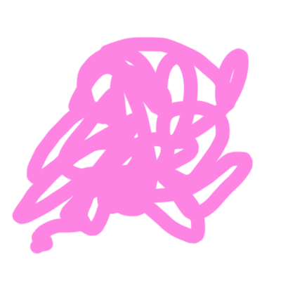

  

  <h3 align="center">Doodler</h3>

  

    A simple doodling tool.
  

<!-- TABLE OF CONTENTS -->

  
Table of Contents

  <ol>
    <li>
      <a href="#about-the-project">About The Project</a>
      <ul>
        <li><a href="#built-with">Built With</a></li>
      </ul>
    </li>
    <li><a href="#usage">Usage</a></li>
    <li><a href="#license">License</a></li>
    <li><a href="#contact">Contact</a></li>
  </ol>

<!-- ABOUT THE PROJECT -->
## About The Project

I am developping a simple doodling tool, to learn to play with the canvas API.
It will probably keep evolving in the next weeks/months.
Why not add the possibility to download your artwork? Or create a multiplayer game based on Websocket? 😼

### Built With

* HTML
* CSS
* JavaScript / React
* Deployed with Surge

<!-- USAGE EXAMPLES -->
## Usage

Fancy doodling something? → https://doodler.surge.sh/

<!-- LICENSE -->
## License

Distributed under the MIT License. See `LICENSE` for more information.

<!-- CONTACT -->
## Contact

Jeanne Lemière - [@Linkedin](https://www.linkedin.com/in/jeanne-lemi%C3%A8re-a4b36a1bb/)
